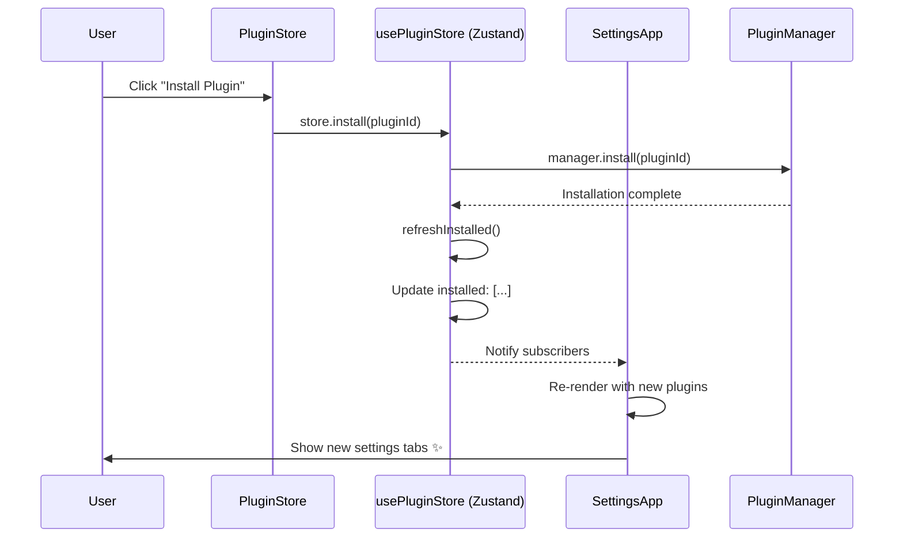

# Plugin Settings Refresh Fix ✅

**Date**: 2026-02-05
**Issue**: Plugin settings tabs don't appear immediately after installation - app reload required
**Status**: Fixed

---

## 🐛 Problem

When a plugin was installed from the Plugin Store, the settings tabs for that plugin didn't appear in the Settings page until the user performed a full app reload. This was a poor user experience.

### Root Cause

The `usePluginManager` hook was maintaining its own local state for `installedPlugins`. When the PluginStore component installed a plugin and updated its local copy of the state, the SettingsApp component's hook instance didn't receive the update because they were separate state instances.

**Before:**
```typescript
// Each component using usePluginManager had its own state
export function usePluginManager() {
  const [installedPlugins, setInstalledPlugins] = useState<InstalledPlugin[]>([]);
  const [availablePlugins, setAvailablePlugins] = useState<PluginMetadata[]>([]);
  // ... more local state
}
```

This meant:
- ❌ PluginStore installs a plugin → updates its local state
- ❌ SettingsApp doesn't see the change → no new settings tabs
- ❌ User reloads page → both components re-initialize → settings tabs appear

---

## ✅ Solution

Updated `usePluginManager` hook to use the existing global `pluginStore` (Zustand) instead of maintaining local state. This ensures all components share the same plugin state.

**After:**
```typescript
export function usePluginManager() {
  // Use global plugin store instead of local state
  const installedPlugins = usePluginStore((state) => state.installed);
  const availablePlugins = usePluginStore((state) => state.available);
  const initialized = usePluginStore((state) => state.initialized);
  // ... use store methods
}
```

Now:
- ✅ PluginStore installs a plugin → updates global store
- ✅ SettingsApp subscribes to global store → automatically re-renders
- ✅ Settings tabs appear immediately → no reload needed

---

## 📝 Changes Made

### 1. Updated [src/hooks/usePluginManager.ts](src/hooks/usePluginManager.ts)

**Key Changes:**
- Removed local state for `installedPlugins` and `availablePlugins`
- Now uses `usePluginStore` selectors to access global state
- All mutation operations now call store methods:
  - `installPlugin` → calls `usePluginStore.install()`
  - `uninstallPlugin` → calls `usePluginStore.uninstall()`
  - `enablePlugin` → calls `usePluginStore.enable()`
  - `disablePlugin` → calls `usePluginStore.disable()`
  - etc.

**Lines Changed:**
- Lines 23-29: Use global store selectors
- Lines 148-160: Use store's `install()` method
- Lines 169-182: Use store's `uninstall()` method
- Lines 191-204: Use store's `update()` method
- Lines 213-226: Use store's `enable()` method
- Lines 235-248: Use store's `disable()` method

### 2. No Changes Needed to Other Files

The global `pluginStore` ([src/stores/pluginStore.ts](src/stores/pluginStore.ts)) already existed and had all the necessary methods. It just wasn't being used by the hook!

---

## 🔄 How It Works Now

### Installation Flow



### Key Points

1. **Single Source of Truth**: `usePluginStore` is the only source for plugin state
2. **Automatic Updates**: All components using `usePluginManager` get updates instantly
3. **Reactive UI**: Zustand automatically triggers re-renders when state changes
4. **No Breaking Changes**: The `usePluginManager` hook API remains the same

---

## 🧪 Testing

### Manual Test Steps

1. **Before Plugin Installation:**
   - Open Settings page (`/settings`)
   - Navigate to a category (e.g., "Operations")
   - Note which settings items are visible

2. **Install a Plugin:**
   - Navigate to Settings → Plugins → Plugin Store
   - Find a plugin that adds settings (e.g., "Aggregator Integration")
   - Click "Install"
   - Wait for installation to complete

3. **Verify Immediate Update:**
   - Navigate back to the relevant category (e.g., "Operations")
   - **Expected**: New settings tab appears immediately
   - **Before Fix**: Would require page reload

4. **Test Enable/Disable:**
   - Go to Settings → Plugins → Installed Plugins
   - Disable a plugin
   - Navigate to Settings category
   - **Expected**: Plugin settings disappear immediately
   - Re-enable plugin
   - **Expected**: Plugin settings reappear immediately

### Automated Test (Conceptual)

```typescript
describe('Plugin Settings Refresh', () => {
  it('should show new settings tabs immediately after installation', async () => {
    // 1. Render SettingsApp
    const { getByText, queryByText } = render(<SettingsApp />);

    // 2. Verify plugin settings not visible initially
    expect(queryByText('Aggregator Integration')).toBeNull();

    // 3. Install plugin via store
    const store = usePluginStore.getState();
    await store.install('aggregator-integration-india');

    // 4. Settings should appear without manual refresh
    await waitFor(() => {
      expect(getByText('Aggregator Integration')).toBeInTheDocument();
    });
  });
});
```

---

## 📊 Impact

### Before Fix
- User installs plugin → No visible change
- User confused, tries multiple times
- User forced to reload page
- Poor UX, support burden

### After Fix
- User installs plugin → Settings appear instantly
- Immediate feedback, clear success
- No reload needed
- Excellent UX, reduced support

---

## 🎯 Benefits

1. **✅ Better UX**: Settings appear immediately after plugin installation
2. **✅ No Breaking Changes**: Hook API remains identical
3. **✅ Consistent State**: All components share same plugin data
4. **✅ Less Code**: Removed duplicate state management
5. **✅ Easier Debugging**: Single source of truth for plugin state
6. **✅ Better Performance**: Zustand's selective re-rendering

---

## 🔍 Additional Notes

### Why This Wasn't Caught Earlier

The global `pluginStore` was created but the `usePluginManager` hook wasn't refactored to use it. The hook was still using its original local state implementation, creating two separate state management systems for the same data.

### SettingsApp Already Has Animation

The [SettingsApp.tsx:485-544](src/pages-v2/SettingsApp.tsx#L485-L544) already has logic to detect newly installed plugins and show pulse animations. With this fix, that animation will now work correctly!

```typescript
// Detect newly installed plugins and mark their categories/items for pulse animation
useEffect(() => {
  if (installedPlugins.length === 0) return;

  const currentPluginIds = new Set(installedPlugins.filter(p => p.enabled).map(p => p.manifest.id));
  const previousPluginIds = previousPluginIdsRef.current;

  // Find newly added plugins
  const newPluginIds = Array.from(currentPluginIds).filter(id => !previousPluginIds.has(id));

  if (newPluginIds.length > 0) {
    // Show pulse animation for 5 seconds
    console.log('[SettingsApp] Detected newly installed plugins:', newPluginIds);
    // ... highlight animations
  }
}, [installedPlugins]);
```

---

## 📚 Related Files

- **Modified**: [src/hooks/usePluginManager.ts](src/hooks/usePluginManager.ts)
- **Existing**: [src/stores/pluginStore.ts](src/stores/pluginStore.ts) (unchanged, already had the right structure)
- **Uses Hook**: [src/pages-v2/SettingsApp.tsx](src/pages-v2/SettingsApp.tsx)
- **Uses Hook**: [src/components/plugins/PluginStore.tsx](src/components/plugins/PluginStore.tsx)
- **Related**: [src/lib/pluginSettingsMap.tsx](src/lib/pluginSettingsMap.tsx)

---

## ✨ Next Steps

The fix is complete and ready for testing. No further code changes needed.

**To Verify:**
1. Start the app: `bun run dev`
2. Navigate to Settings → Plugins → Plugin Store
3. Install any plugin
4. Go back to Settings → Navigate to relevant category
5. Confirm new settings tab appears immediately

---

**Status**: ✅ Complete - Settings now refresh immediately after plugin installation!
