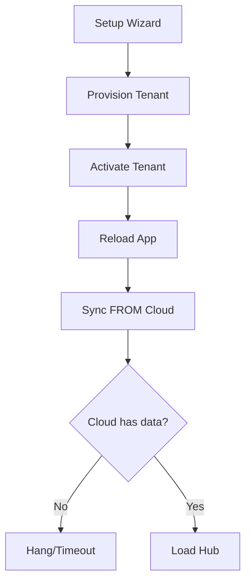
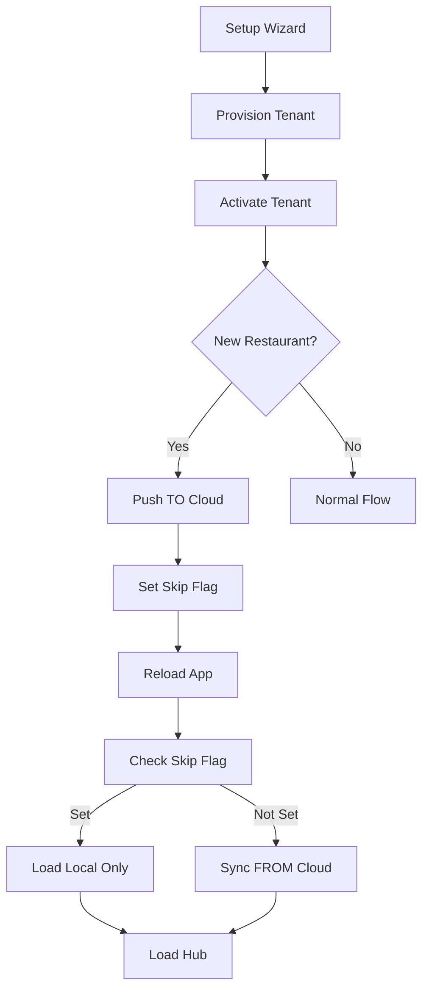

# Sync Direction Fix - Local-First for New Restaurants

## Problem Description

After activation, the app was freezing because it tried to sync FROM cloud (pull), but for newly created restaurants, the cloud database is empty. This caused:

1. **Freezing**: Sync operations waiting for cloud data that doesn't exist
2. **Wrong direction**: Pulling empty data from cloud instead of pushing local data to cloud
3. **Data loss risk**: Local setup data could be overwritten by empty cloud data

## Root Cause

### Old Workflow (Incorrect for New Restaurants)
```
1. Setup locally → Create restaurant data
2. Provision tenant → Create cloud infrastructure
3. Activate tenant
4. App reload → Sync FROM cloud (pull)
5. Cloud database is empty → Hang or overwrite local data
```

### Why This Was Wrong

The provisioning API creates cloud infrastructure (DNS, KV, D1, R2, worker), but **does NOT populate the database**. The database is empty until data is pushed to it.

When the app tried to sync FROM cloud after activation:
- Restaurant settings: Empty
- Staff members: Empty
- Floor plan: Empty
- Menu: Empty

Result: App freezes waiting for data or overwrites local data with empty cloud data.

## Solution Implemented

### New Workflow (Correct)

```
1. Setup locally → Create restaurant data
2. Provision tenant → Create cloud infrastructure
3. Activate tenant
4. ✅ Detect if new restaurant (is_restaurant_owner flag)
5. ✅ Complete setup → Save to local database
6. ✅ Push local data to cloud (local → cloud)
7. App reload → Skip cloud sync (data already pushed)
8. Load from local database → Fast, no network delay
```

### Key Changes

#### 1. Detection of New vs Existing Restaurant

**File**: [src/pages/TenantActivation.tsx:201](src/pages/TenantActivation.tsx#L201)

```typescript
const isNewRestaurant = localStorage.getItem('is_restaurant_owner') === 'true';
```

This flag is set during setup wizard when a new restaurant is created.

#### 2. Push to Cloud After Activation

**File**: [src/pages/TenantActivation.tsx:223-243](src/pages/TenantActivation.tsx#L223-L243)

```typescript
if (tenant && isNewRestaurant) {
  // For NEW restaurants: Push local data to cloud
  console.log('[TenantActivation] 🔄 NEW restaurant detected - pushing local data to cloud...');

  const { initialSyncService } = await import('../lib/initialSyncService');
  const syncResult = await initialSyncService.pushAllToCloud(tenant.tenantId);

  if (syncResult.success) {
    console.log('[TenantActivation] ✅ Local data pushed to cloud successfully');
  }

  // Mark that we've synced (so App.tsx doesn't try to sync again)
  localStorage.setItem(`pos_last_sync_${tenant.tenantId}`, new Date().toISOString());
  sessionStorage.setItem('skip-initial-sync', 'true');
}
```

**What This Does**:
- Calls `initialSyncService.pushAllToCloud()` to push:
  - Restaurant settings
  - Staff members
  - Floor plan
  - Printer config
  - Aggregator settings
- Sets sync flags to prevent redundant sync after reload

#### 3. Skip Cloud Sync on First Load

**File**: [src/App.tsx:605-652](src/App.tsx#L605-L652)

```typescript
const skipInitialSync = sessionStorage.getItem('skip-initial-sync') === 'true';
const setupJustCompleted = sessionStorage.getItem('setup-just-completed') === 'true';

if (skipInitialSync || setupJustCompleted) {
  console.log('[App] ⏭️ Skipping cloud sync - new restaurant (data already pushed to cloud)');

  // Load from local database only (no cloud sync)
  await useRestaurantSettingsStore.getState().loadFromSQLite();
  // ... load other local data

  // Clear the skip flag
  sessionStorage.removeItem('skip-initial-sync');
  sessionStorage.removeItem('setup-just-completed');
} else {
  // Normal flow: Load local then sync from cloud
  await useRestaurantSettingsStore.getState().syncFromCloud(tenantId);
  // ... sync other data from cloud
}
```

**What This Does**:
- Checks if this is first load after activation
- If yes: Load from local database only (fast, no network)
- If no: Normal sync from cloud (for existing restaurants)

#### 4. Skip Background Sync

**File**: [src/App.tsx:668-689](src/App.tsx#L668-L689)

```typescript
const skipInitialSync = sessionStorage.getItem('skip-initial-sync') === 'true';
const setupJustCompleted = sessionStorage.getItem('setup-just-completed') === 'true';

if (skipInitialSync || setupJustCompleted) {
  console.log('[App] ⏭️ Skipping background sync - new restaurant (already synced)');
  return;
}

// Normal background sync for existing restaurants
await useRestaurantSettingsStore.getState().syncFromCloud(tenantId);
```

## Sync Engine: initialSyncService

### Methods Used

#### `pushAllToCloud(tenantId: string)`

**Purpose**: Push all local data to cloud

**What it syncs**:
1. Restaurant settings
2. Staff members
3. Floor plan
4. Printer configuration
5. Aggregator settings

**Returns**: `SyncResult` with success status and errors

**File**: [src/lib/initialSyncService.ts:352-435](src/lib/initialSyncService.ts#L352-L435)

#### `performInitialSync(tenantId: string)`

**Purpose**: Pull all data from cloud to local (for existing restaurants)

**What it syncs**:
1. Restaurant settings
2. Staff members
3. Floor plan
4. Menu items
5. Dine-in pricing
6. Printer configuration
7. Aggregator settings

**File**: [src/lib/initialSyncService.ts:103-282](src/lib/initialSyncService.ts#L103-L282)

## Flow Comparison

### Before Fix (Froze on Activation)



### After Fix (Fast, No Freeze)



## Console Logs to Expect

### New Restaurant Activation

```javascript
// During activation:
[TenantActivation] Activation successful, completing setup
[TenantActivation] Setup not marked complete, completing now...
[SetupWizard] ===== STARTING SETUP COMPLETION =====
[SetupWizard] ✅ Setup completed and saved to database
[TenantActivation] ✅ Setup completed and saved to database

[TenantActivation] 🔄 NEW restaurant detected - pushing local data to cloud...
[InitialSync] Pushing all local data to cloud for tenant: restaurant-xxxx
[RestaurantSettings] Pushing settings to cloud...
[StaffStore] Pushing staff to cloud...
[FloorPlanStore] Pushing floor plan to cloud...
[InitialSync] Push to cloud completed in XXXms, errors: 0
[TenantActivation] ✅ Local data pushed to cloud successfully

[TenantActivation] Device registered successfully
[TenantActivation] Navigating to hub
[App] Tenant activated, clearing awaitingActivation flag
```

### After Reload

```javascript
[App] Initializing...
[App] Starting auto sync for tenant: restaurant-xxxx
[App] ⏭️ Skipping cloud sync - new restaurant (data already pushed to cloud)
[App] Loading restaurant settings from SQLite...
[App] ✅ Loaded from local database, skipped cloud sync
[App] Showing hub page
```

### Existing Restaurant Login

```javascript
[App] Starting auto sync for tenant: existing-restaurant
[App] Loading restaurant settings from SQLite...
[App] Syncing restaurant settings from cloud...
[RestaurantSettings] Syncing from cloud...
[RestaurantSettings] Cloud settings found, merging...
[App] Syncing staff members...
[App] Syncing floor plan...
[App] Showing hub page
```

## Error Handling

### If Push to Cloud Fails

```typescript
try {
  const syncResult = await initialSyncService.pushAllToCloud(tenant.tenantId);
  // ...
} catch (syncError) {
  console.error('[TenantActivation] Failed to push to cloud:', syncError);
  // Don't block activation - data is saved locally and can sync later
}
```

**Result**:
- Activation still succeeds
- Data is saved locally
- User can manually sync from Settings page
- Next app reload will try to sync again

### If Setup Completion Fails

```typescript
try {
  await wizardState.completeSetup();
} catch (setupError) {
  console.error('[TenantActivation] Failed to complete setup:', setupError);
  // Don't block activation if setup completion fails
  // User can manually save settings from Settings page
}
```

**Result**:
- Activation still succeeds
- User might see setup wizard again on next launch
- User can manually save settings

## Session Flags

### `skip-initial-sync`

**Set by**: TenantActivation after pushing to cloud
**Used by**: App.tsx to skip sync on first load
**Cleared by**: App.tsx after first load
**Storage**: sessionStorage (cleared on tab close)

### `setup-just-completed`

**Set by**: SystemCheckScreen when navigating to activation
**Used by**: App.tsx to skip sync on first load
**Cleared by**: App.tsx after first load
**Storage**: sessionStorage (cleared on tab close)

### `is_restaurant_owner`

**Set by**: SystemCheckScreen/SimpleRestaurantOnboarding when creating restaurant
**Used by**: TenantActivation to determine if new restaurant
**Cleared by**: Never (persists across sessions)
**Storage**: localStorage

### `pos_last_sync_{tenantId}`

**Set by**: TenantActivation after push, or initialSyncService after pull
**Used by**: initialSyncService.needsInitialSync() to check if sync needed
**Cleared by**: Never (persists across sessions)
**Storage**: localStorage

## Files Modified

### 1. [src/pages/TenantActivation.tsx](src/pages/TenantActivation.tsx)
**Lines 201-243**: Added push to cloud for new restaurants

**Changes**:
- Detect if new restaurant via `is_restaurant_owner` flag
- Call `initialSyncService.pushAllToCloud()` to push local data to cloud
- Set sync flags to prevent redundant sync

### 2. [src/App.tsx](src/App.tsx)
**Lines 605-657**: Skip cloud sync on first load after activation
**Lines 668-689**: Skip background sync for new restaurants

**Changes**:
- Check `skip-initial-sync` and `setup-just-completed` flags
- If set: Load from local database only (no cloud sync)
- If not set: Normal sync from cloud (existing restaurants)

### 3. [src/lib/initialSyncService.ts](src/lib/initialSyncService.ts)
**No changes** - Used existing `pushAllToCloud()` method

## Testing Checklist

### Test 1: ✅ New Restaurant Creation

1. Clear all data: `localStorage.clear()`, `sessionStorage.clear()`
2. Start app: `bun tauri dev`
3. Complete setup wizard
4. Provisioning creates tenant and activation code
5. Navigate to activation screen
6. Enter activation code and activate
7. **Expected**: Console shows:
   ```
   [TenantActivation] 🔄 NEW restaurant detected - pushing local data to cloud...
   [TenantActivation] ✅ Local data pushed to cloud successfully
   ```
8. App reloads
9. **Expected**: Console shows:
   ```
   [App] ⏭️ Skipping cloud sync - new restaurant (data already pushed to cloud)
   [App] ✅ Loaded from local database, skipped cloud sync
   ```
10. **Expected**: Hub loads FAST (no network delay)
11. Check Settings page - restaurant name and all settings saved

### Test 2: ✅ Existing Restaurant Login

1. Use existing activation code (not from fresh setup)
2. Enter code and activate
3. **Expected**: Console shows normal sync:
   ```
   [App] Syncing restaurant settings from cloud...
   [App] Syncing staff members...
   [App] Syncing floor plan...
   ```
4. **Expected**: Data synced from cloud

### Test 3: ✅ Cloud Data Verification

1. Complete new restaurant setup and activation
2. After activation and push to cloud, check cloud database (via admin panel or API)
3. **Expected**: Cloud database contains:
   - Restaurant settings with correct name
   - Staff members (if any created during setup)
   - Floor plan (if any created during setup)

### Test 4: ✅ Subsequent Logins (After Initial Setup)

1. Complete setup and activation (Test 1)
2. Close app completely
3. Reopen app
4. **Expected**: Console shows normal sync (because flags are cleared):
   ```
   [App] Syncing restaurant settings from cloud...
   ```
5. **Expected**: Data synced from cloud as normal

## Success Criteria

✅ No freezing during activation
✅ Fast app load after activation (no network delay)
✅ Local data pushed to cloud successfully
✅ Cloud database populated with restaurant data
✅ Settings persist after activation
✅ No "setup needed" loop after activation
✅ Existing restaurants still sync normally from cloud
✅ Console logs show correct flow

## Benefits

### 1. **No Freezing**
App doesn't wait for cloud sync that will never return data

### 2. **Fast Activation**
Local data loads instantly, no network latency

### 3. **Correct Data Flow**
Local → Cloud for new restaurants (correct)
Cloud → Local for existing restaurants (correct)

### 4. **Data Integrity**
Local setup data is preserved and pushed to cloud
No risk of overwriting with empty cloud data

### 5. **Offline Resilience**
If push to cloud fails, data is still saved locally
Can sync later when connection is restored

### 6. **Clear Logging**
Console shows exactly what's happening:
- NEW restaurant: "pushing local data to cloud"
- EXISTING restaurant: "syncing from cloud"

## Future Improvements

### 1. Retry Logic for Push Failures

Add automatic retry if push to cloud fails:
```typescript
let retries = 3;
while (retries > 0) {
  try {
    await initialSyncService.pushAllToCloud(tenantId);
    break;
  } catch (error) {
    retries--;
    if (retries === 0) throw error;
    await new Promise(resolve => setTimeout(resolve, 1000));
  }
}
```

### 2. Progress UI During Push

Show progress bar during push to cloud:
```typescript
initialSyncService.onStatusChange((status) => {
  console.log(`Syncing: ${status.step} (${status.progress}%)`);
  // Update UI with progress
});
```

### 3. Conflict Resolution

If cloud data exists when pushing, merge instead of overwrite:
```typescript
const hasCloudData = await checkCloudData(tenantId);
if (hasCloudData) {
  // Merge local and cloud data
  await mergeData(tenantId);
} else {
  // Push local data to cloud
  await pushAllToCloud(tenantId);
}
```

### 4. Background Push

Push to cloud in background without blocking activation:
```typescript
// Activate immediately
onActivated();

// Push in background
setTimeout(() => {
  initialSyncService.pushAllToCloud(tenantId);
}, 1000);
```

## Summary

The activation freeze is now fixed by:

1. **Detecting new restaurants** via `is_restaurant_owner` flag
2. **Pushing local data to cloud** using `initialSyncService.pushAllToCloud()`
3. **Skipping cloud sync** on first load after activation
4. **Loading from local database** only (fast, no network delay)

This ensures the correct data flow:
- **New restaurants**: Local → Cloud (setup data pushed to cloud)
- **Existing restaurants**: Cloud → Local (cloud data synced to local)

Test the complete flow end-to-end to confirm no freezing and data syncs correctly!
